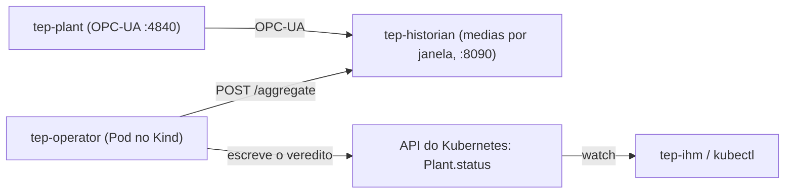

# 01 — Visao geral

## O que e esse repo?

Esse e o **operator Kubernetes** que da a um cluster a capacidade de acompanhar uma planta industrial em alto nivel. Ele nao le sinais brutos e nao atua na planta. Ele recebe, por manifesto, uma **funcao de custo** (a funcao objetivo J) e uma **politica de operacao** (metas, restricoes, orcamento de custo), e reporta no `status` do objeto `Plant` se a planta esta cumprindo a politica ativa.

O operator e **generico**: nao ha nada de TEP no codigo Go. Todo conhecimento especifico da planta mora nos manifestos (no caso do TEP, em `tep-supervisor/local/k8s/tep/`). O TEP e o primeiro caso de uso.

## Onde esse repo se encaixa

```
spec-tennessee-eastman  <- issues, specs, decisoes de arquitetura (epic #77)
tep-plant               <- a planta (Rust), publica sinais via OPC-UA
tep-historian           <- coleta os sinais e serve medias por janela via HTTP
tep-operator            <- ESTE REPO: o operator K8s (Go)
tep-supervisor          <- infra (Kind, compose) e os manifestos TEP
tep-ihm                 <- dashboard; le o veredito do Plant pela API do K8s
```



O k8s nunca ve sinal bruto. O historian traduz sinais em estatisticas, o operator traduz estatisticas em veredito, e o k8s guarda o veredito e avisa quem estiver observando.

## Tecnologia

- **Go 1.25+** com **Kubebuilder 4.12** (controller-runtime v0.23)
- API group: `supervision.greenlabs.io/v1alpha1`
- 3 CRDs: `CostFunction`, `OperatingPolicy`, `Plant` (ver [03](03-crds.md))
- Fonte de dados: `tep-historian` via HTTP/JSON

## Estado atual

| O que                                                                 | Status                                                |
| --------------------------------------------------------------------- | ----------------------------------------------------- |
| CRDs Plant / OperatingPolicy / CostFunction                           | Pronto                                                |
| Avaliacao de J, metas, restricoes, persistencia (`internal/evaluate`) | Pronto, testado (caso base Downs & Vogel = 170.6 $/h) |
| Reconciler de Plant                                                   | Pronto, testado com envtest                           |
| Teste ponta a ponta no Kind                                           | Feito (planta + historian no host)                    |
| Atuar na planta (setpoints)                                           | Fora de escopo                                        |

## Para rodar

```bash
make generate manifests                       # regenera deepcopy, CRDs e RBAC
make test                                     # unitarios + envtest
make docker-build
# deploy no Kind: ver tep-supervisor/local/setup.sh
```
